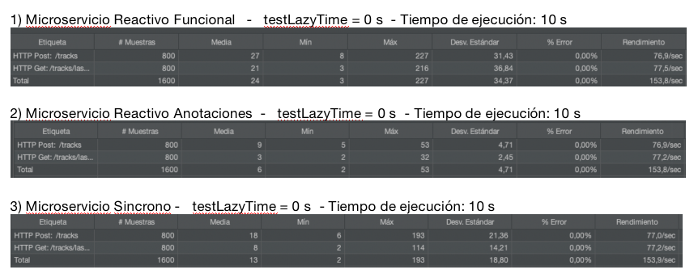
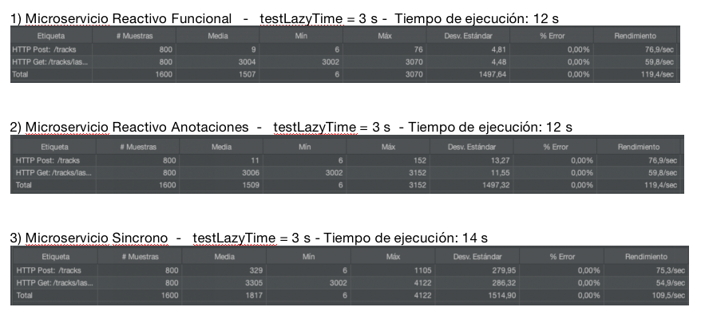
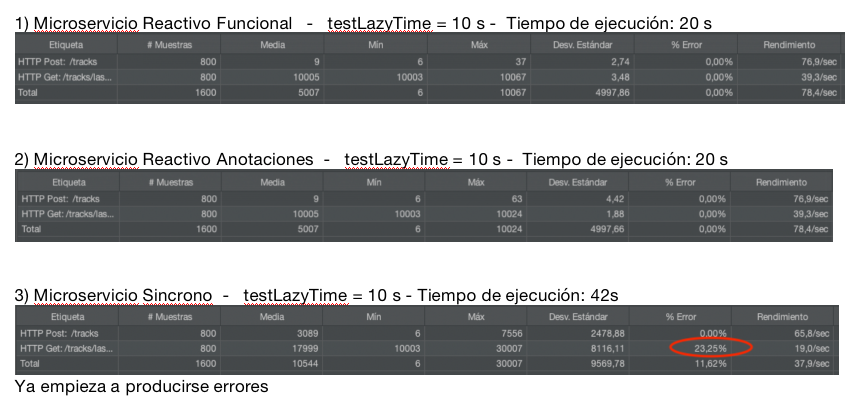

# Spring Reactive Demo

Este es un ejemplo para ver un microservicio de Geo-tracking implementado de tres formas: reactiva funcional, reactiva con anotaciones y de forma sincrona.

## Run (Docker-compose)

Para ejecutar la aplicación en un entorno local utilizando Docker

```bash
# Build and create Jar files for the microservices
mvn clean install 

# Before we continue, we'll check our build-file for syntax-errors:
docker-compose -f docker/docker-compose.yml config

# Then we can build our images, create the defined containers, and start it in one command:
docker-compose -f docker/docker-compose.yml --project-name "spring-reactive-demo" up --build -d
```


Otros comandos:

```bash
# Stop services
docker-compose -f docker/docker-compose.yml --project-name "spring-reactive-demo" stop

# Start service
docker-compose -f docker/docker-compose.yml --project-name "spring-reactive-demo" start

# Stop and remove containers, networks
docker-compose -f docker/docker-compose.yml --project-name "spring-reactive-demo" down

# Build or rebuild services
docker-compose -f docker/docker-compose.yml --project-name "spring-reactive-demo" build

# Create and start containers
docker-compose -f docker/docker-compose.yml --project-name "spring-reactive-demo" up -d

# Returns a live data stream for running containers
docker stats
```

## Observabilidad con Prometehus + Grafana

```bash
# Build or rebuild services
docker-compose -f docker/docker-compose-observability.yml --project-name "spring-reactive-demo" build

# Create and start containers
docker-compose -f docker/docker-compose-observability.yml --project-name "spring-reactive-demo" up -d

# Stop services
docker-compose -f docker/docker-compose-observability.yml --project-name "spring-reactive-demo" stop

# Start service
docker-compose -f docker/docker-compose-observability.yml --project-name "spring-reactive-demo" start

# Stop and remove containers, networks
docker-compose -f docker/docker-compose-observability.yml --project-name "spring-reactive-demo" down

# Prometheus panel web
http://localhost:9090/targets

# Grafana panel web
http://localhost:3000/explore 
```


## Swagger API

```bash
# API documentation for geotracking-reactive-funcional-microservice
http://localhost:8081/swagger-ui.html

# API documentation for geotracking-reactive-annotation-microservice
http://localhost:8082/swagger-ui.html

# API documentation for geotracking-synchronous-microservice
http://localhost:8083/swagger-ui.html
```

## Pruebas de rendimiento

Las pruebas se han realizado con jMeter, cada prueba consta de una ejecucion lanzando 800 threads durante 10s. Cada threads ejecutaba dos peticiones consecutivas:
- Una peticion POST, que guarda el tracking de un usuario.
- Una peticion GET, que devuelve la ultima posicion de un usuario. A esta petición se le puede indicar a traves del parámetro "testLazyTime" en el header, que simule una llamada a un servicio externo que tarde en responder los segundos indicados. De esta foma podemos simular casos en los que una petición depende de llamadas a otros servicios o APIS externas que tardan en responder.

Se hace una prueba en cada micro. La llamada es la misma para cada micro pero ciambiando el puerto.

```bash
# Microservicio reactivo funcional (puerto: 8081)
curl --location 'http://localhost:8081/tracks/lastPosition?user=X00005' --header 'testLazyTime: 0'

# Microservicio reactivo con anotaciones (puerto: 8082)
curl --location 'http://localhost:8082/tracks/lastPosition?user=X00005' --header 'testLazyTime: 0'

# Microservicio sycrono (puerto: 8083)
curl --location 'http://localhost:8083/tracks/lastPosition?user=X00005' --header 'testLazyTime: 0'
```


### Escenarios que se realizan las pruebas

1. Situción ideal: el proceso externo es rápido
2. El proceso externo es un poco lento
3. El proceso exteerno es lento
4. El proceso externo es muy lengo.


Manos a la obra con jMeter:


### 1. Situción ideal: el proceso externo es rápido

```bash
# Indicamos al servicio perezoso que no se pare y sea rapido en su respuesta

curl --location 'http://localhost:8083/tracks/lastPosition?user=X00005' --header 'testLazyTime: 0'
```
Resultados: 



### 2. El proceso externo es un poco lento

```bash
# Indicamos al servicio perezoso que tarde en responder 3 segundos

curl --location 'http://localhost:8083/tracks/lastPosition?user=X00005' --header 'testLazyTime: 3'
```

Resultados: 



### 3. El proceso externo es lento

```bash
# Indicamos al servicio perezoso que tarde en responder 5 segundos

curl --location 'http://localhost:8083/tracks/lastPosition?user=X00005' --header 'testLazyTime: 5'
```

Resultados: 


### 4. El proceso externo es muy lento

```bash
# Indicamos al servicio perezoso que tarde en responder 10 segundos

curl --location 'http://localhost:8083/tracks/lastPosition?user=X00005' --header 'testLazyTime: 10'
```

Resultados: 



## Conclusión

Hemos visto en un entorno ideal apenas hay diferencia entre un microservicio reactivo a uno sincrono. Donde si se ven las diferencias es conforme vamos teniendo procesos externos que relentizan las operaciones, llegando al caso mas desfavorable, donde ademas de tardar mucho mas en finalizar todas las operaciones el microservicio sincrono, no es capaz de finalizar todos los procesos correctamente como si ocurre en el microservicio reactivo.